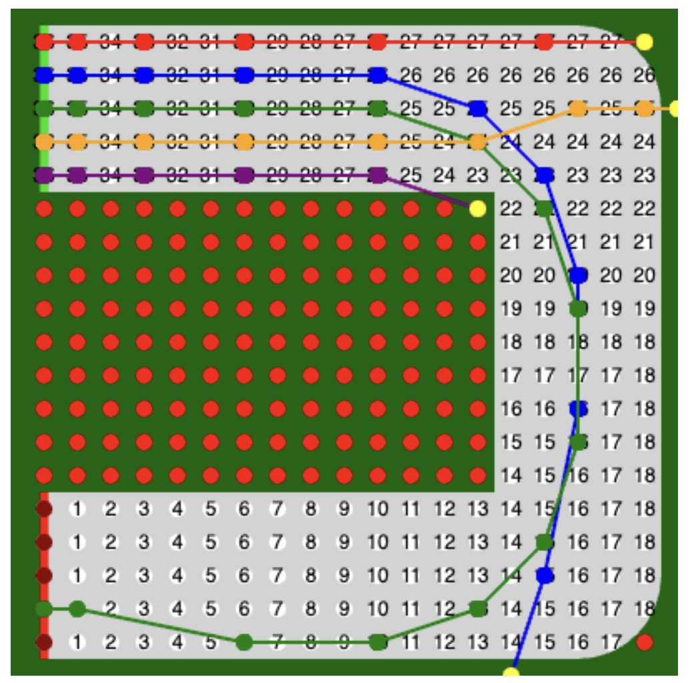

# Martin Gardner Racetrack Game

The code here allows you to simulate a game of
[Racetrack](https://en.wikipedia.org/wiki/Racetrack_(game)) with one or more
automated players.

# Rules

The game presents you with a racetrack (path) overlaid on a grid of points. The
race cars begin on the starting line, and attempt to reach the finish line
(first).

As a driver, the only control you have is to adjust your current acceleration in
the *x* and *y* directions.  In this implementation, you can choose any
combination of -1, 0, and +1 acceleratiokn for each of *x* and *y*.

At each step, the simulator will calculate your new position on the grid and
velocity on the track, and ask you so choose your next move.  Eventually, you
will either crash (leave the track) or finish (cross the finish line).

*If you want to play online manually, check out [Vector
Racer](http://www.harmmade.com/vectorracer/) - not affiliated with this
project.*

# CodePen Simulation

The easiest way to use this repo is to fork a copy of [this
CodePen](https://codepen.io/mckoss/pen/RwYVmGO).



Here you can see a number of different strategies racing against each other (only one of which succeeding).

# How to Program a Racer

If you use CodePen, there is only minimal boilerplate to
program a race.

```
// Import the racetrack library into CodePen
import { Racetrack, U_TRACK } from 'https://mckoss.com/racetrack/scripts/racetrack.js';

// Attach the a new Racetrack simulation to a <canvas> element
const rt = new Racetrack(document.getElementById('stage'), U_TRACK);

// This is where you register your racer.  The callback function
// will be called once for each step of the race.
rt.race((state, options) => {
  return [1, 0];
});
```

You are provided with two pieces of information at each step:

The car state:

```
{
    status: 'running' | 'crashed' | 'finished' | 'error';
    step: number;
    position: Point;
    velocity: Point;
}
```

```status``` is a string with one of 4 values.

```step``` starts and 1 and increments by one for each step of the race.

```position``` is your car's current ```[x, y]``` coordinate on the racetrack.  Units here are in pixels in the canvas *(I should probably make this grid coordinates)*.

```velocity``` is is your car's current volocity.  Note that the units are relative to the grid points, not to pixels.

A ```Point``` is just a two-element array with an ```[x, y]``` coordinate.

```options``` are an array of the 9 distinct moves you could make and information about the outcomes.

```
[
    {
        move: Point;
        position: Point;
        distanceToFinish: number | undefined;
        status: 'ok' | 'crashed' | 'finished';
    },
    ...
]
```

For each ```option``` you see what the ```move``` needed to
get there (one of [0, 0], [-1, -1], [-1, 0], ... etc.)).

The ```position``` you will end up.

The ```distanceToFinish``` (the total number of grid points to the finish line, taking the shortest path).  These are
the number displayed in the grid, above.

And a ```status``` about whether that move will make you crash or cross the finish line.

## Future Update

I will be updating the options list to also provide some distance
measures to walls from your current position.

# Designing your own Tracks

Tracks are implemented as a single path around a grid.

```
interface Track {
    dim: Point,
    grid: number;
    startLine: [Point, Point];
    finishLine: [Point, Point];

    trackWidth: number;
    path: Point[];
}
```

```dim``` Dimensions of the canvas element (in pixels).

```grid``` The spacing of the grid (number of pixels between grid points).

```startline``` The pixel coordinates of a line segment defining the starting line.

```finishLine``` Same for the finishing line.

```trackWidth``` How wide the track path is in pixels.

```path``` A sequence of points defining the centerline of the track (typically
drawns from the starting line to the finishing line).

The example ```U_TRACK``` is defined as:

```
const U_TRACK:Track = {
    dim: [400, 400],
    grid: 20,
    startLine: [[20, 10], [20, 110]],
    finishLine: [[20, 290], [20, 390]],
    trackWidth: 100,
    path: [[20, 60], [340, 60], [340, 340], [20, 340]],
}
```


